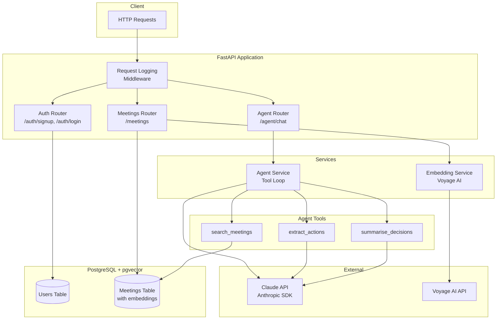

# MeetingMate

A FastAPI service that ingests meeting transcripts, stores them with vector embeddings, and provides an AI agent to answer questions about your meetings.

**What it does:**
- Store meeting transcripts with semantic search (pgvector)
- Ask questions about past meetings using natural language
- Extract action items and key decisions automatically
- JWT authentication for secure access

## Architecture



## Quick Start

### Prerequisites

- Python 3.11+
- Docker and Docker Compose
- Anthropic API key
- Voyage AI API key (for embeddings)

### 1. Clone and Setup

```bash
git clone <repo-url>
cd meetingmate

# Create virtual environment
python -m venv .venv
source .venv/bin/activate  # On Windows: .venv\Scripts\activate

# Install dependencies
pip install -r requirements.txt
```

### 2. Configure Environment

```bash
cp .env.example .env
# Edit .env with your API keys
```

Required environment variables:
- `DATABASE_URL`: PostgreSQL connection string
- `ANTHROPIC_API_KEY`: Your Anthropic API key
- `VOYAGE_API_KEY`: Your Voyage AI API key
- `JWT_SECRET`: Secret for signing JWT tokens

### 3. Start Database

```bash
docker compose up -d
```

### 4. Run Migrations

```bash
alembic upgrade head
```

### 5. Start the Server

```bash
uvicorn main:app --reload
```

The API is now running at `http://localhost:8000`.

## Example API Calls

### Create an Account

```bash
curl -X POST http://localhost:8000/auth/signup \
  -H "Content-Type: application/json" \
  -d '{"email": "user@example.com", "password": "securepassword123"}'
```

### Login

```bash
curl -X POST http://localhost:8000/auth/login \
  -H "Content-Type: application/json" \
  -d '{"email": "user@example.com", "password": "securepassword123"}'
```

Response:
```json
{"access_token": "eyJhbGciOiJIUzI1NiIs..."}
```

### Ingest a Meeting Transcript

```bash
curl -X POST http://localhost:8000/meetings \
  -H "Content-Type: application/json" \
  -H "Authorization: Bearer <your-token>" \
  -d '{
    "title": "Q4 Planning Review",
    "transcript": "Sarah: Lets discuss the Q4 roadmap..."
  }'
```

### Ask the Agent a Question

```bash
curl -X POST http://localhost:8000/agent/chat \
  -H "Content-Type: application/json" \
  -H "Authorization: Bearer <your-token>" \
  -d '{"question": "What action items came out of the Q4 planning meeting?"}'
```

### List Your Meetings

```bash
curl http://localhost:8000/meetings \
  -H "Authorization: Bearer <your-token>"
```

## API Endpoints

| Method | Endpoint | Description |
|--------|----------|-------------|
| POST | `/auth/signup` | Create a new user account |
| POST | `/auth/login` | Authenticate and get JWT token |
| GET | `/auth/me` | Get current user info |
| POST | `/meetings` | Ingest a meeting transcript |
| GET | `/meetings` | List your meetings (paginated) |
| GET | `/meetings/{id}` | Get a specific meeting |
| POST | `/agent/chat` | Ask questions about your meetings |
| GET | `/health` | Basic health check |
| GET | `/health/db` | Database connectivity check |

## Agent Tools

The AI agent uses three tools to answer questions:

1. **search_meetings**: Semantic search across your meeting transcripts using vector similarity
2. **extract_actions**: Pull action items with assignees and deadlines from a transcript
3. **summarise_decisions**: Identify key decisions with context and participants

## Running Tests

```bash
pytest
```

## Project Structure

```
meetingmate/
├── main.py              # FastAPI app entry point
├── app/
│   ├── routers/         # API route handlers
│   │   ├── auth.py      # Signup, login, me endpoints
│   │   ├── meetings.py  # Meeting CRUD endpoints
│   │   └── agent.py     # Agent chat endpoint
│   ├── models/          # SQLAlchemy models
│   ├── schemas/         # Pydantic request/response models
│   ├── services/        # Business logic
│   │   ├── agent.py     # Agent loop with tool calling
│   │   ├── tools.py     # search, extract, summarise functions
│   │   └── embeddings.py
│   ├── auth.py          # JWT utilities
│   ├── database.py      # Database connection
│   └── config.py        # Environment configuration
├── alembic/             # Database migrations
├── tests/               # Pytest test suite
├── examples/            # Sample meeting transcript
├── docker-compose.yml   # Postgres with pgvector
└── requirements.txt     # Pinned dependencies
```

## License

MIT
